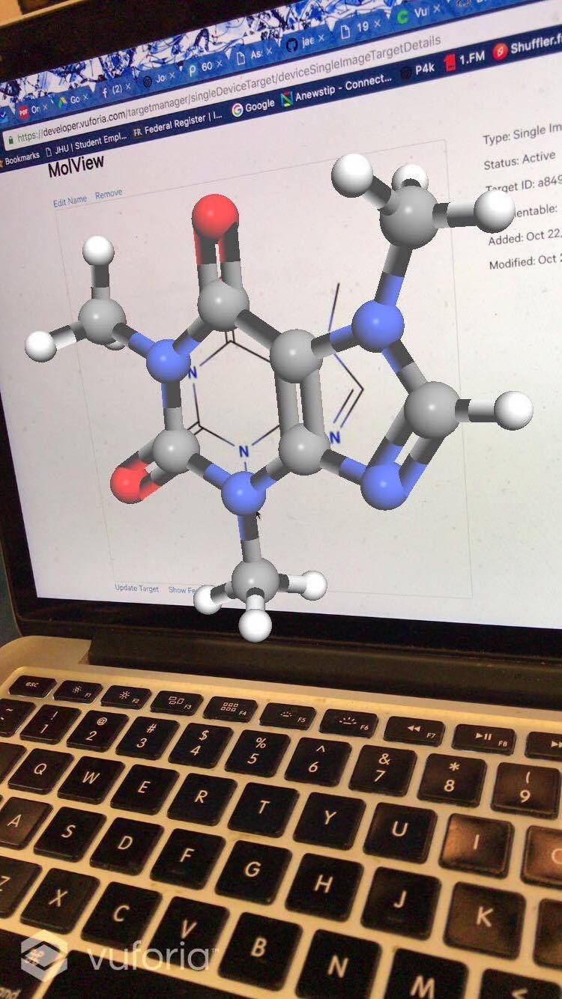
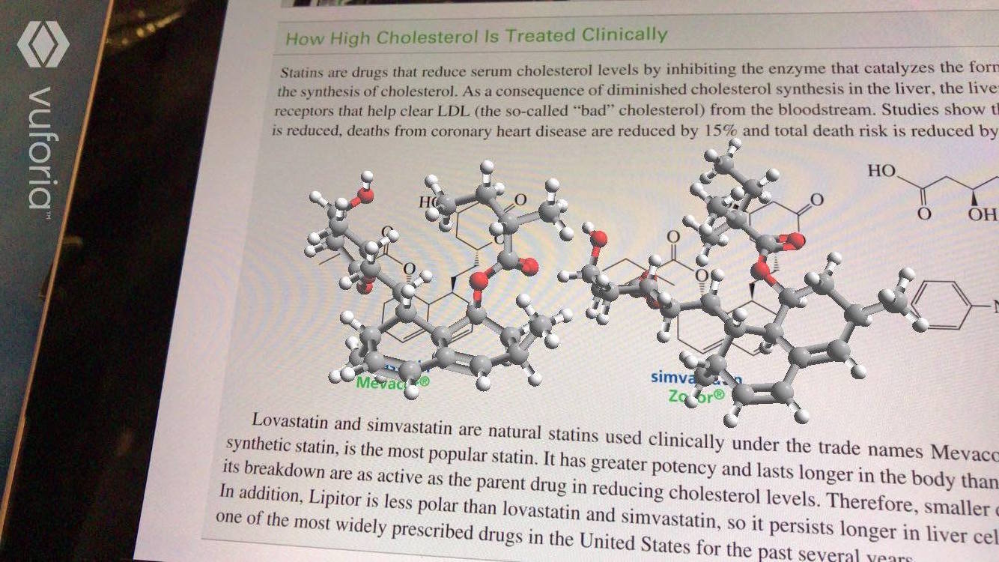

# Orgo Savior

This is an AR app for the 3D visualization of chemical molecules. It is based on [Vuforia](https://developer.vuforia.com/).

## PREREQUISITE
1. Download the [Vuforia SDK for iOS](https://developer.vuforia.com/downloads/sdk) and upack it to the `external-deps` folder. 
2. Create a Vuforia license key
	- follow steps [here](https://developer.vuforia.com/library/articles/Solution/How-To-Create-an-App-License), you can get a **Starter** plan free of charge after registeration.
3. Copy your License key to the right place (a value of `AR_CONFIG_INIT_FLAG` key) in **AppDelegate.m**
4. Change the developer profile
5. Run the project **Orgo Savior**

## USAGE
Scan a molecular formula using our app and it will project a 3D chemical molecular model, which can be zoomed in/out and be rotated. There is also a button for saving the picture for later review.
Target images can be found in **images/targets/**
## CUSTOMIZE
You can customize the app with a confiuration, which is need when instantiating `ARViewController`. Datasets and models configuration are supported.

- `AR_CONFIG_DATA_SETS` : to configure datasets
- `AR_CONFIG_MODEL` : to configure 3D models

Developed by Minwei Xu, Xinyu Huang, Xiaowei Wang, Allen Ren for HopHacks Fall 2016.

Special thanks to [Vuforia-iOS-Lib](https://github.com/CharlyZhang/Vuforia-iOS-Lib/)
